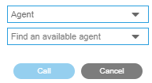

# Flexible Contact Center - User guide

## Main concepts

## The agent

### How to connect

#### Starting the Flexible Contact Center Desktop

After the program has been installed on your computer, Click the Windows Start button, then « Flexible Contact Center Desktop »

Enter your login and password when prompted

> Tip
>
> The administrator has setup the agents in the Selfcare interface, and communicates them their login and password.

#### The console and the voice agent banner

You are now connected to FCC Desktop, and your agent console is displayed.

To display the Voice agent banner, click on the top-right telephone icon : 

> Tips
>
> By default, the agent console opens on the tab « My activities »
>
> For a supervisor, the Voice banner has to be displayed to access the supervision tabs in the console

### The agent console

A menu is accessible in the top left corner to navigate to the different parts  of the console:

#### My activities

This part shows the statistics of the day

- About your activities since the beginning of the day
- About the queues you are assigned to

> Tips 
>
> In the administrator Selfcare, green / red thresholds can be defined for each indicator to provide a visual feedback on these statistics.

#### Voice recordings

In the recordings part, it is possible for an agent to search his call recordings of the day: within a timeframe; by type of calls (inbound, outbound, conference, between agents, voicemail); for specific queues.

> Tips
> The call recording policy is set up in the administrator Selfcare.
> Agents can only access their own call recordings, and for the current day; only supervisors can search by agent and by date.

Each line indicates: the call id, the number of recording parts, the date and time of the first recording part, the duration (total of the recording parts).

One line can be expanded to show :

- The name of the agent
- The ANI (phone number of the customer)
- The DNIS (the access number to reach the contact center)
- The queue
- The type of call
- Date and start time
- Duration
- Link and icon to download the audio file

> Tips
> Click on the icon in the blue zone to playback the complete conversation
> Click on an icon in the white zone to playback only the corresponding part of the conversation

### The voice banner

#### overview

#### Agent status

The status can be changed by the agent at any time :

- « Available » to start working

- One of the « Break »* codes to stop receiving calls

- « Logout » to stop working with FCC

  

> Tips
>
> The agent must be « Available » to receive calls, callback requests, voice messages
>
> No particular status is required to make an outbound call
>
> During a conversation, the status color becomes red
>
> (*) different « Break » codes can be defined by the administrator via the [Selfcare](#the-administrator)

#### Manage the agent phone number

Depending on permissions*, the agent can set the phone number that will be used to receive and make calls :

- Click on the « settings » gear icon
- Enter the phone number
- Confirm by clicking « OK »

> Tips
>
> If the phone number is empty, the agent status can not be changed to « available »
>
> (*) The administrator sets the permissions in the [Selfcare](#the-administrator):
>
> > If the agent should not be allowed to change his phone number (then the administrator has to set it)
>
> > If the agent should be allowed to change his phone number, and if the number can be memorized or if it has to be set at each connection

#### Notification in the agent banner

The supervisor console enables a supervisor to:

- Send a message to an agent
- Change the status of an agent

When that happens, the agent receives a notification that has to be acknowledged.

> Tip
>
> The message is presented over the area to change the status and the phone number.

### Handling calls

#### Receiving a call

When a call is distributed to the agent, the phone rings and the voice banner displays the context of the call: contact phone number, name of the queue, and the waiting time

To take the call, the agent pick up the phone. During the conversation the agent can use the voice banner actions

Above the buttons, the agent has a visual indication of how long the current conversation is lasting, compared to pre-defined time thresholds set by the administrator*

Green below 1st threshold

Orange when 1st threshold is passed

Red when 2nd threshold is passed

> Tips
>
> (*) This setting can be set per queue, in the [Selfcare](#the-administrator)

#### Call transfer or conference during a conversation

While in conversation, the agent can click this button to transfer or to start a conference ; a list appears with the different possibilities, which can be :

- agent (only available agents can be selected)

When an « available » agent is selected, the banner indicates « In conversation » ; it is now possible to :
Transfer the call or start a conference ; the other agent then receives the call with all the context information.

- agent group

- directory (external contacts)

> Tips
>
> (*) The directory for external contacts is managed in the [administrator Selfcare](#the-administrator)

- phone number

- queue

#### Making a call

The agent can make a call by clicking this button The list of possibilities for the destination is then displayed: agent, agent group, directory, or phone number. After selection, the call is established in 3 steps:

1. The agent's phone is called, the agent picks up
2. The destination phone is called; the agent can see a message displayed in the voice banner
3. The destination phone is picked up; the call is established

#### Wrapping up a call

At the end of a call, a wrap-up code can be required (*) to indicate the reason or outcome of the call.

A counter indicates the remaing time (in seconds) left to choose the wrap-up code in the drop-down list.

To complete, the agent clicks on the "Close" button.

Once the call is terminated, a trace is automatically saved in Salesforce [^1]

> Tips
> The counter turns red for the last seconds
> The counter can be set to be clickable, so the agent can extend the wrap-up time
> If the selected wrap-up code is « other », the agent has to give more information in a free text zone
> Different call queues can use different wrap-up codes
>
> (*) The administrator determines if a wrap-up code is required or not. When it is, the administrator has to indicate the possible wrap-up codes, and the counter duration in seconds.

#### Traces of a call [^1]

xxx

### Callback

There are 2 ways for a customer to request a callback:

- During the interaction with the IVR (*), the customer can be invited to request a callback
- During the conversation with the agent, the agent can offer to book a telephone appointment for later

#### Callback presentation to the agent

In all cases, the request is handled by Flexible Contact Center and distributed to an agent. It is presented within the voice banner:

On top of the usual call context information (phone number, queue), the name of the contact, the subject and the description of the callback request is displayed in the "Notes" zone.

If the agent accepts the callback request, his phone rings, and after picking it up, the destination number is called.

> Tips
> (*) The administrator can define the places in the IVR script in which he wishes to propose to the caller to be recalled via the Selfcare.

#### Callback scheduling by the agent

By clicking on the  button, the agent can schedule the callback request by specifying:

- the date / time at which the customer wishes to be called back (entry is guided by clicking on the icons and )
- the queue associated with this callback
- whether the callback request should be presented to the agent in priority
- the subject and content of the message that will be displayed to the agent who will process the request

After clicking "Save", a confirmation is displayed : 

> Tips
> If the agent is in communication, the caller's number is automatically filled in
> The delete key is used to delete all the values entered. To abort the callback request, the agent can switch to the "Notes" tab

### The softphone

xxx

## The supervisor

Supervisors have the same rights as agents, plus additional features; they are accessible via the menu in the top left corner:

### The dashboard

The dashboard presents an overview of the contact center activity. For voice, it means:

- the list of the call queues, with number of calls waiting and longest waiting time)
- the volume of inbound calls by time of day (hours)
- the service level indicators
- the different break status used by the agents

### Queue supervision

The list of queues, along with indicators, is presented in the top part.

When a queue is selected is selected in the list, the bottom part shows all indicators for that specific queue, as well as a visual summary.

> Tips
> The queues visible in the top list, as well as the indicators and respective thresholds, are set up in the administrator Selfcare
> The bottom details section contains all the possible indicators, including those not visible in the top list

### Agent supervision

### Voice recordings

### Statistics

### Other supervision tools

## The administrator

The main interface for the administrator is the Selfcare.

xxx

[^1]: Available if the option "Salesforce CRM integration" is subscribed